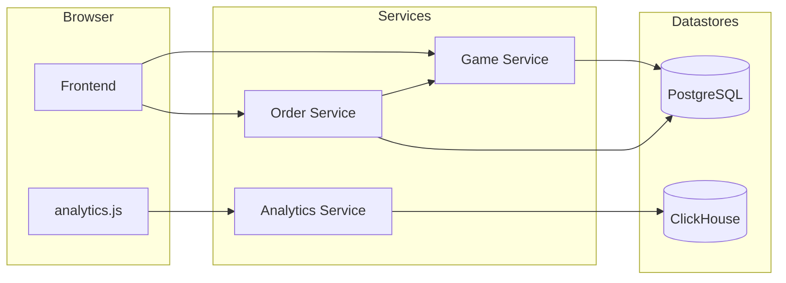

# Lugex — Gaming Shop Microservices with Realtime Analytics

A production-style microservices demo for a gaming shop. It ships a static frontend, two Node.js backend services (Games and Orders) on PostgreSQL, and an Analytics pipeline backed by ClickHouse. Everything runs locally via Docker Compose, and can be deployed to Kubernetes with the provided manifests.

- Frontend: static site served by NGINX with client-side event tracking
- Game Service: CRUD for games using Sequelize + PostgreSQL
- Order Service: creates orders, enriches line items by calling Game Service
- Analytics Service: receives browser events and writes them to ClickHouse
- Datastores: PostgreSQL (OLTP), ClickHouse (OLAP)

---

## TL;DR — Run Locally

```bash
# From repo root
docker compose up --build
```

Then:
- Frontend: http://localhost:8080
- Game API: http://localhost:3000
- Order API: http://localhost:3001
- Analytics API: http://localhost:3002

Note: The repo folder is `Frontend/` but the compose file mounts `./frontend`. Rename the folder to `frontend` or update `docker-compose.yml` accordingly.

---

## Architecture



---

## Services and Ports

- Frontend (NGINX): `:8080` → serves files under `Frontend/`
- Game Service: `:3000` → `Backend/gaming-service`
- Order Service: `:3001` → `Backend/order-service`
- Analytics Service: `:3002` → `Backend/analytics-service`
- PostgreSQL: `:5432`
- ClickHouse: `:8123` (HTTP), `:9000` (native)

Docker volumes:
- `pgdata` for PostgreSQL
- `clickhouse_data` for ClickHouse

---

## API Quick Reference

### Game Service (`/games`)
- GET `/all` → list games
- GET `/:id` → get game by id
- POST `/add` → create game
  - body: `{ name, category, releaseDate, price }`
- PUT `/edit` → update by id
  - body: `{ id, name, category, releaseDate, price }`
- DELETE `/delete/:id` → delete by id

### Order Service (`/orders`)
- POST `/add` → create order with items; computes total by querying Game Service
  - body: `{ customerName, items: [{ gameId, quantity }] }`
- GET `/all` → list orders with items
- PUT `/edit/:id` → replace items and recompute total
  - body: `{ customerName, items: [{ gameId, quantity }] }`
- DELETE `/delete/:id` → delete order

### Analytics Service
- POST `/track` → ingest an event into ClickHouse
  - body: `{ eventType, page, timestamp, sessionId, ...extra }`
  - `timestamp` format: `YYYY-MM-DD HH:mm:ss`

---

## Frontend Analytics Integration

The file `Frontend/assets/js/analytics.js` sends browser events.

Set the endpoint constant before building/deploying:

```js
// Frontend/assets/js/analytics.js
const analyticsEndpoint = 'http://localhost:3002/track'; // local docker compose
```

For Kubernetes, set this to your Analytics Service external URL, for example:

```js
const analyticsEndpoint = 'http://<analytics-service-load-balancer-dns>/track';
```

Events sent automatically:
- `page_view` on page load
- `click` on any document click (includes `target` text)
- `time_on_page` on unload with `{ seconds }`

---

## Local Development

### Prerequisites
- Docker Desktop (or Docker Engine) + Docker Compose v2
- Optional: Node.js 18+ if you want to run services outside Docker

### Compose Services
Defined in `docker-compose.yml`. It builds backend services from their Dockerfiles, runs PostgreSQL and ClickHouse, and serves the static frontend via NGINX.

Start/stop:
```bash
docker compose up --build -d
docker compose down -v   # stops and removes volumes
```

Quick smoke tests:
```bash
# Create a game
curl -X POST http://localhost:3000/games/add \
  -H 'Content-Type: application/json' \
  -d '{"name":"Elden Ring 2","category":"RPG","releaseDate":"2022-02-25","price":200}'

# List games
curl http://localhost:3000/games/all | jq

# Place an order (assumes game id = 1)
curl -X POST http://localhost:3001/orders/add \
  -H 'Content-Type: application/json' \
  -d '{"customerName":"Alice","items":[{"gameId":1,"quantity":2}]}'

# Track an analytics event
curl -X POST http://localhost:3002/track \
  -H 'Content-Type: application/json' \
  -d '{"eventType":"page_view","page":"/","timestamp":"2025-01-01 12:00:00","sessionId":"abc123"}'
```

ClickHouse UI (HTTP): `http://localhost:8123` (submit queries as GET with `?query=`). A table `default.events` is created from `init.sql`.

---

## Kubernetes Deployment

Manifests are provided for each component. Images in the deployments reference an example AWS ECR registry. Replace those image references with your own registry or push to the referenced ECR.

Apply manifests (namespace optional):
```bash
kubectl apply -f postgres-deployment.yaml -f postgres-service.yaml
kubectl apply -f clickhouse-deployment.yaml -f clickhouse-service.yaml
kubectl apply -f game-service-deployment.yaml -f game-service.yaml
kubectl apply -f order-service-deployment.yaml -f order-service.yaml
kubectl apply -f analytics-deployment.yaml -f analytics-service.yaml
kubectl apply -f frontend-deployment.yaml -f frontend-service.yaml
```

All services are `LoadBalancer` where applicable; retrieve public URLs:
```bash
kubectl get svc
```

Update the frontend `analyticsEndpoint` to point to your Analytics Service URL (see section above).

Notes:
- Internal service DNS names used by services: `game-service`, `order-service`, `postgres`, `clickhouse`.
- PostgreSQL service name in the manifest is `postgres`.
- Sequelize configuration in services currently uses static hostnames (e.g., `postgres`). Ensure your K8s `Service` names match, or update the Node configs to read env vars.

---

## Building Images Manually

```bash
# Game Service
docker build -t your-registry/game-service:latest -f Backend/gaming-service/Dockerfile Backend/gaming-service

# Order Service
docker build -t your-registry/order-service:latest -f Backend/order-service/Dockerfile Backend/order-service

# Analytics Service
docker build -t your-registry/analytics-service:latest -f Backend/analytics-service/Dockerfile Backend/analytics-service

# Frontend (optional; compose uses nginx:alpine with a bind mount)
docker build -t your-registry/frontend:latest -f Frontend/Dockerfile Frontend
```

Push to your registry and update the Kubernetes manifests accordingly.

---

## Testing with Postman

Import the collection and environment under `tests/`:
- `tests/integration-env.postman_collection.json`
- `tests/integration-env.postman_environment.json`

The collection contains requests for:
- Game Service CRUD
- Order Service CRUD
- Analytics track endpoint

Update environment base URLs to your local (`localhost`) or Kubernetes LoadBalancer endpoints.

---

## Data Model

PostgreSQL (via Sequelize):
- `Game`: `{ name, category, releaseDate, price }`
- `Order`: `{ customerName, total }`
- `OrderItem`: `{ gameId, quantity, orderId }` with `Order hasMany OrderItem` as `items`

ClickHouse (MergeTree):
- `default.events(eventType String, page String, timestamp DateTime, sessionId String)`

---

## AWS Lambda (Optional)

A sample `Backend/Lambda function.py` shows how to aggregate ClickHouse events and upload CSV summaries to S3. It queries ClickHouse over HTTP, builds a CSV, and writes to `lugx-analytics-data-...` bucket under the `clickhouse-exports/` prefix.

---

## Project Structure

```
Lugex/
  Backend/
    gaming-service/         # Node/Express + Sequelize (Games)
    order-service/          # Node/Express + Sequelize (Orders)
    analytics-service/      # Node/Express + ClickHouse client
  Frontend/                 # Static site (NGINX)
  docker-compose.yml
  *-deployment.yaml         # K8s Deployments
  *-service.yaml            # K8s Services
  init.sql                  # ClickHouse table (events)
  tests/                    # Postman collection + environment
```

---

## License and Credits

- Frontend template: TemplateMo “LUGX Gaming” (`templatemo.com`)
- This repository is provided for educational/demo purposes.

---

## Troubleshooting

- If the frontend shows no analytics calls, ensure `analyticsEndpoint` is set to the correct URL and that CORS allows your origin.
- If Order Service returns `Invalid gameId`, ensure the Game Service is reachable from the Order Service and that the game exists.
- On Linux/WSL, verify the compose volume path matches the `Frontend/` directory case.

Happy shipping! 🚀
